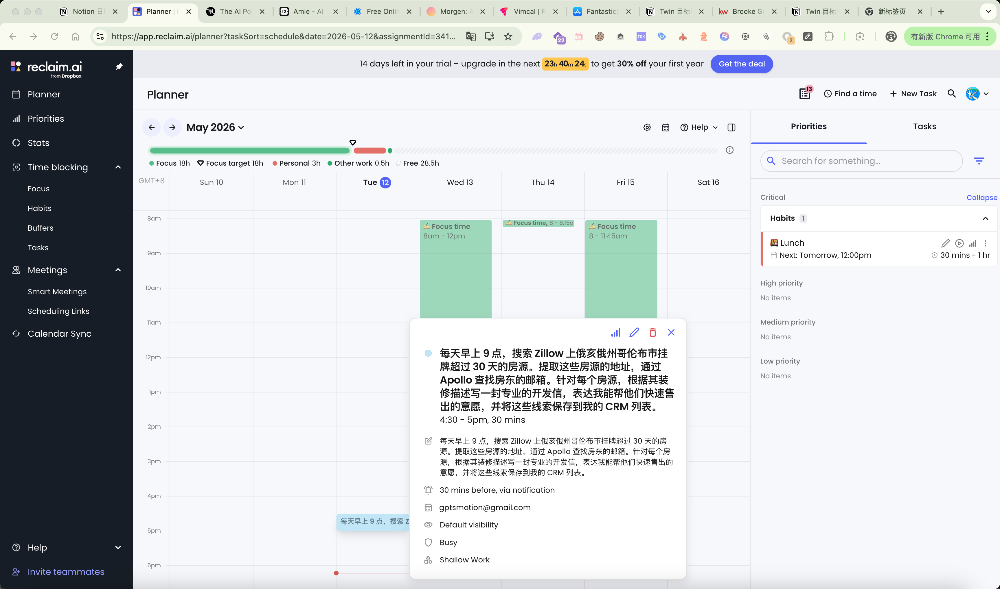

# 产品设计文档 V1 — 日历心智模型

# 一、设计概述

## 核心洞察

用户不需要“又一个 AI 工具后台”。他们需要的是：**AI 把做好的事放在他们每天都会看的地方**。

日历是每个职业人士每天必打开的界面。如果 AI Agent 的执行结果不是藏在某个工具的对话历史里，而是以日程事件的形态出现在用户的日历上——用户就不需要“记得去看结果”，结果会主动出现在她的必经之路上。

## 心智模型对比

| 传统 AI 工具 | 日历心智模型 |
| --- | --- |
| 用户需要主动打开一个新工具 | 用户打开的是她每天都打开的日历 |
| 结果以“对话记录”形态存在，淹没在历史消息中 | 结果以今天的日程事件形态存在，天然有时间锚点 |
| 用户需要“记得去看结果” | 结果出现在用户必经的路径上 |
| 产品是一个“需要学习的新后台” | 产品是日历上多出来的一行字，零学习成本 |
| 用户与 AI 的关系是“我去找 AI” | 用户与 AI 的关系是“AI 把做好的事放在我桌上” |

## 核心类比

> 这不是“AI 助手”，这是“每天早上帮你把报纸和咖啡放在桌上的管家”——你不需要去找管家，管家已经把东西放好了。
> 

---

# 二、一句话假设

> 我们认为 [挂靠头部品牌的住宅经纪人（如 Lauren Lucas, Keller Williams Columbus）] 在 [维护“本地市场专家”人设、持续发布社媒内容] 时有 [白天忙于带看签约，每周花 5 小时手动整理市场数据并撰写帖子] 的痛点，如果我们提供 [每日自动拉取本地市场数据 + 用本人语气 AI 撰写 + 以日历日程形态推送草稿供确认后发布] 的能力，他们会 [每天早上打开日历确认一下就完成内容发布，将内容建设时间从每周 5 小时降为每天 30 秒]。
> 

---

# 三、用户主路径（Critical Path）

## 角色

Lauren Lucas，Keller Williams Columbus，房产经纪人

## 她的原始需求（模糊版）

> “每天早上九点帮我抓取俄亥俄州哥伦布市的房地产市场数据，专门监控俄亥俄州富兰克林县新发布的房源信息。一旦有新房源出现，就依据我的发帖风格自动生成一封个性化的推广邮件。我希望你仔细研究一下我手动撰写的5篇LinkedIn帖子——[附上链接或文本]——并模仿我的这种风格去撰写 LinkedIn 帖子并发送。”
> 

### 第一幕：入口 — 从日历进入，而非从 AI 工具进入

**用户看到的界面：** Notion Calendar 周视图，今天是周二。

Lauren 早上 8:45 打开 Notion Calendar 看今天的日程。她看到的不是一个空的 AI 对话框，而是自己熟悉的日历界面——10 点带看 Worthington 的房子，下午 2 点签约会议。

但在 9:00 AM 的时间格上，她注意到一个**由 AI 自动填入的日程块**：

<aside>
📌 **“哥伦布今日市场速报 — 富兰克林县 3 套新房源”**
9:00 AM · 自动生成 · 待你确认

</aside>

**关键设计：这个日程块是“草稿态”**——AI 已经把所有内容准备好了，但不会自动发布任何东西。它安静地躺在日历上，等待 Lauren 确认。

**她点击这个日程块。** 展开后看到一个结构化的“待办卡片”：

---

**今日哥伦布 · 富兰克林县市场动态**

📊 **市场概览：**中位价 $287,500（周环比↑1.2%），在售库存 342 套，新增 3 套

🏠 **3 套新房源摘要：**

- 1847 Summit St — $265,000 · 3bed/2bath · 上市第 1 天
- 923 E Broad St — $310,000 · 4bed/2.5bath · 上市第 1 天
- 4501 Refugee Rd — $189,000 · 2bed/1bath · 上市第 1 天

✉️ **LinkedIn 帖子草稿（待确认）：**

> “你们有没有注意到最近 Clintonville 的房子上得越来越快了？🏠 今天富兰克林县又多了三套独栋——Summit St 那套 $265k，三居室，对年轻家庭来说真的很 solid。想知道现在入手的时机对不对？来聊👇”
> 

**操作按钮：**

- ✅ 确认发布
- ✏️ 编辑后发布
- ⏭️ 今天跳过
- 🔓 以后不用确认，直接发

📧 **3 封推广邮件草稿（待确认）：**

- → 查看并逐封确认
- → 全部发送

---

### 核心设计：草稿占位 + 用户确认

| 设计点 | 说明 |
| --- | --- |
| AI 提前准备好一切 | 数据抓取、风格模仿、帖子撰写、邮件起草——全部在用户醒来之前完成 |
| 但不替用户做最终决定 | 帖子不会自动发到 LinkedIn，邮件不会自动发给客户。一切以“草稿”形态呈现 |
| 用户用 30 秒完成确认 | 点开日历 → 扫一眼帖子 → 点“确认发布”。从查看到完成，30 秒 |
| 用户可以逐步放权 | 连续一周觉得帖子质量 OK → 点“以后不用确认，直接发”→ 从此 AI 自动发布 |
| 随时可以收回控制 | 即使设了“直接发”，任何时候都可以改回“需要确认”模式 |

> **信任是逐步建立的。** 第一天用户一定要看，第三天她开始信任，第七天她点了“直接发”，第三十天她忘了这件事的存在——因为它就是自己在跑。
> 

---

### 第二幕：操作 — 首次设置（只发生一次）

**Step 1 — 用模糊的自然语言描述需求**

Lauren 打开产品，在输入框里写了她的那段原始需求。

**Step 2 — AI 帮她从模糊走向具体（不超过 3 轮反问）**

AI 像一个经验丰富的助理，帮她把模糊的想法变成精确的执行计划。

**第 1 轮反问 — 明确数据范围和筛选条件：**

> 收到。关于富兰克林县的新房源监控，我需要确认几个细节：

**你关注哪类房产？**
🔘 独栋住宅 · 🔘 公寓/联排 · 🔘 所有住宅类型

**价格范围有偏好吗？**
🔘 不限 · 🔘 $200k 以下 · 🔘 $200k-$400k · 🔘 $400k 以上
> 

Lauren 点选：「独栋住宅」+「$200k-$400k」

**第 2 轮反问 — 明确内容风格的学习素材：**

> 好的，独栋住宅，$200k-$400k。接下来关于你的 LinkedIn 发帖风格——

**请把你写过的 5 篇帖子发给我。**你可以：
🔘 粘贴帖子文字 · 🔘 发送 LinkedIn 帖子链接
> 

Lauren 粘贴了 5 篇帖子文本。

**第 3 轮确认 — AI 总结执行计划，用户一键确认：**

> 我分析了你的 5 篇帖子。你的风格是：**开头用一个反问句或数据引入，中间给出本地市场分析，结尾附行动号召，语气是专业但亲和的——像朋友间聊天但你是那个懂行的朋友。**

以下是我将为你做的事：

📅 **每天早上 9 点自动执行：**
1. 抓取富兰克林县当日新上市的独栋住宅（$200k-$400k）
2. 汇总哥伦布市整体市场数据（中位价、库存、趋势）
3. 用你的风格生成一篇 LinkedIn 帖子草稿
4. 为每套新房源生成一封个性化推广邮件草稿
5. 将以上内容推送到你的 Notion Calendar 作为 9:00 AM 日程事件，**等你确认后再发布**

🟦 开始构建 · ⬜ 我想调整
> 

Lauren 点击「开始构建」。

**Step 3 — 构建完成即包含第一次真实运行**

构建过程中需要 Lauren 参与的：

- LinkedIn 授权：弹出 OAuth 窗口，点一下“允许”
- Notion Calendar 授权：同上

其余全部自动。构建卡片实时滚动：

> 🔄 正在连接哥伦布房产数据源…
🔄 正在分析你的 5 篇 LinkedIn 帖子风格…
🔄 正在创建富兰克林县新房源监控…
✅ LinkedIn 授权成功
✅ Notion Calendar 授权成功
🔄 正在进行第一次试运行…
> 

**关键设计：构建本身就包含一次真实运行。** AI 不会说“配好了，明天试试吧”，而是当场用真实数据跑一次，让用户立刻看到结果。

构建完成后，Lauren **当场**看到第一次真实产出：

> ✅ **“哥伦布市场速报”构建完成，首次运行已交付**

📊 今日富兰克林县：2 套新增独栋住宅（$200k-$400k）
• 1847 Summit St — $265,000 · 3bed/2bath
• 4501 Refugee Rd — $189,000 · 2bed/1bath

✉️ LinkedIn 帖子草稿：
“哥伦布的各位，今天富兰克林县多了两套值得看的房子——Summit St 那套 3 居室 $265k，对 Clintonville 的买家来说是个信号……”

📧 2 封推广邮件草稿已生成
📅 已在你的 Notion Calendar 上创建 9:00 AM 日程事件

🟦 满意，设为每日自动 · ⬜ 我想调整
> 

Lauren 此刻的感受不是“希望明天能用”，而是**“这就是明天我每天会收到的东西”**。

---

### 第二幕 B：不满意时的调整路径

**情况 A：帖子风格不像她**

Lauren 说：“帖子太书面了。我写东西更随意，会用 emoji，会直接跟粉丝说‘你们’，开头喜欢用问句。你再看看我第 3 篇和第 5 篇，那两篇最像我。”

AI 调整后当场给出新版本：

> “你们有没有注意到最近 Clintonville 的房子上得越来越快了？🏠 今天富兰克林县又多了两套——Summit St 那套 $265k 真的值得去看看。想知道现在上车是不是好时机？来聊👇”

🟦 这个感觉对了 · ⬜ 还是不太对，我再说说
> 

点「这个感觉对了」→ AI 更新风格指令，后续每天都按调整后的风格走。

**情况 B：数据范围不对**

Lauren 说：“最近 3 天内上市且还在售的也算进来。价格改成 $150k-$400k。”

AI 当场重跑一次：

> 按新条件，今日结果：**7 套房源**（比之前的 2 套多了 5 套）

🟦 差不多了 · ⬜ 还是太多/太少
> 

**情况 C：整体方向要改**

Lauren 说：“LinkedIn 改成每周一发一篇周报，每天只要邮件汇总就好。”

AI 调整节奏：

- 每天 9 AM：邮件汇总 + 日历事件（不发 LinkedIn）
- 每周一 9 AM：市场周报 + LinkedIn 帖子草稿

**调整路径核心原则：**

| 原则 | 说明 |
| --- | --- |
| 永远在原 Agent 上改 | 不重新来，更新已有指令 |
| 每次改完立刻跑一次给你看 | 不是“改了，明天看效果”，而是当场出新结果 |
| 用户不需要知道她在“调参” | 她只是在跟助理说“不是这样，我要那样” |
| 改动是累积的 | 风格 + 数据范围两个改动叠加保留 |
| 收敛到满意后一键自动化 | 点一次“设为每日自动”，此后不再需要操作 |

> **用户的心理模型：** 我在跟一个新来的助理磨合——我告诉她哪里不对，她改了再给我看一次，改到我满意后，她每天自己干就行了。
> 

---

### 第三幕：结果 — 日历上的“待确认”与“已完成”

**场景 1：正常日 — 有新房源**

早上 8:45，Lauren 打开 Notion Calendar，9:00 AM 有日程块：

<aside>
📌 “哥伦布今日市场速报 — 富兰克林县 3 套新房源” · 待你确认

</aside>

她点开，30 秒完成：

- 扫一眼帖子草稿 → 点「✅ 确认发布」→ LinkedIn 帖子上线
- 扫一眼 3 封邮件 → 选择发送 2 封，跳过 1 封
- 关掉日历，开车去带看

**场景 2：无新房源日**

<aside>
📌 “哥伦布今日市场 — 无新增独栋住宅”

📊 市场概览：中位价 $289,000（周环比↓0.3%），在售库存 338 套
✉️ LinkedIn 帖子草稿（市场趋势分析角度）

→ ✅ 确认发布 | ⏭️ 今天跳过

</aside>

即使没有新房源，“本地市场专家”人设建设也不会断更。

**场景 3：完全信任后 — 自动发布模式**

一周后 Lauren 点了 🔓「以后不用确认，直接发」。

从此日历上的日程块变为：

<aside>
📌 “今日市场速报 — 已自动发布” ✅
9:00 AM · LinkedIn 帖子已发 · 3 封邮件已发

</aside>

她可以不点开——但它在那里，她知道事情被做了。

底部始终有：🔒 改回需要确认 — 随时可以收回控制权。

---

# 四、信任递进模型

| 阶段 | 用户行为 | AI 行为 | 日历呈现 |
| --- | --- | --- | --- |
| Day 1-3：磨合期 | 仔细看每条草稿，修改后确认 | 根据反馈调整风格和数据 | 🟡 待确认 |
| Day 4-7：信任建立 | 快速扫一眼就确认，很少修改 | 稳定输出，风格已收敛 | 🟡 待确认 |
| Day 7+：完全信任 | 点击“以后不用确认” | 自动发布，不再等待 | ✅ 已完成 |
| 任意时刻：收回控制 | 点击“改回需要确认” | 回到草稿模式 | 🟡 待确认 |

> 这个递进是自然发生的——她只是在某一天觉得“每天都不改就确认，那干脆让它直接发吧”，然后点了一个按钮。
> 

---

# 五、验收条件（Done Criteria）

## ✅ 通过标准

- Agent 生成的 LinkedIn 帖子包含**当日真实市场数据**（中位价、库存变动、DOM），可与 Redfin/Zillow 公开数据交叉验证
- 帖子语气经用户确认**符合其个人风格**，不需要大幅修改即可发布
- 结果在指定时间（9:00 AM）前推送到 Notion Calendar，误差不超过 15 分钟
- 连续运行**一周（7 天）**，每天帖子内容不重复，切入角度有变化
- 首次设置全流程 **≤ 15 分钟**（含 OAuth 授权）
- 日历中“确认发布”操作 **3 次点击以内**完成
- “以后不用确认”后 AI 确实自动发布，且用户**随时可改回**手动模式
- 首次构建**当场产出第一次真实结果**，用户不需要“等明天看效果”

## ❌ 失败标准

- 帖子引用的市场数据**与实际数据偏差超过 10%**，损害专业可信度
- 一周内 **2 次以上**帖子内容高度雷同，被粉丝感知为机器生成
- OAuth 过期后 Agent **静默失败**，用户连续 2 天无通知也无错误提醒
- 帖子出现不当内容（极端预测、竞品姓名、“As an AI...”等措辞），引发职业风险
- 日历日程块内容**加载超过 5 秒**或格式混乱
- “确认发布”后 LinkedIn **实际未发布**但日历显示“已发布”——数据不一致
- 首次构建**不包含真实运行**，用户被告知“明天看结果”——失去即时验证感

---

# 六、技术实现路径（概要）

## 日历写入

通过 Notion Calendar API 或 Google Calendar API，以日程事件（Calendar Event）写入：

- **事件标题：**市场速报摘要
- **事件描述：**结构化数据 + 帖子草稿 + 操作按钮链接
- **事件时间：**用户设定的推送时间
- **事件状态：**待确认 / 已确认 / 已完成

## 确认机制

日程事件描述中嵌入操作链接，点击后触发 webhook 回调，执行相应动作（发布 LinkedIn、发送邮件等）。

## 信任递进存储

用户的确认偏好（需确认 / 直接发布）存储在 Agent 持久化数据库中，Agent 每次运行时读取偏好决定行为模式。

## 核心架构

用户日历 ← Agent 写入草稿事件 ← Agent 定时运行（数据抓取 + AI 生成）
用户点击确认 → webhook 回调 → Agent 执行发布动作